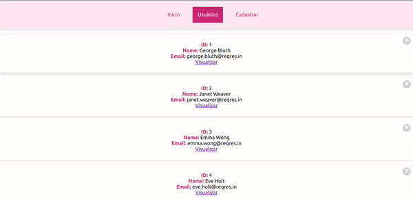
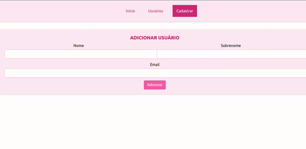
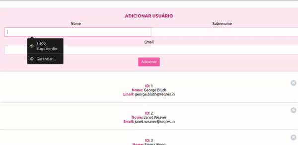

<h1 align="center">React App Using Ajax and HTTP Methods</h1>

  

# Projeto de Estudos React: Explorando Métodos HTTP, Requisições AJAX, Hooks e Rotas 📚🌐

## Visão Geral 🚀

Bem-vindo ao meu projeto de estudos em React focado nos métodos HTTP de API REST e nas requisições AJAX. Este projeto é uma exploração aprofundada dessas técnicas fundamentais no desenvolvimento web moderno.

  

## Objetivo do Projeto 🎯

O objetivo principal é compreender e aplicar de maneira prática os métodos HTTP (GET, POST, PUT, DELETE) para interação com uma API REST, além de explorar o uso de requisições AJAX para atualizar dinamicamente o conteúdo da aplicação.

## Tecnologias Utilizadas 🛠️

- **React:** Bliblioteca principal para o desenvolvimento da interface.
- **JavaScript (ES6+):** Linguagem base para o desenvolvimento.
- **HTML/CSS:** Estruturação e estilização da aplicação.

  

## Funcionalidades Implementadas ✨

- **Métodos HTTP:** Implementação de operações CRUD utilizando GET, POST, PUT e DELETE.
- **Requisições Assíncronas:** Uso de AJAX para atualizações dinâmicas de dados.
- **Uso de Hooks como UseState e UseEffect :** Manipulação do DOM.
- **Rotas:** Usando rotas em uma SPA.
- **Exibição de Dados:** Renderização de informações provenientes da API REST.

## Como Usar o Projeto 🛠️💻

1. **Clone o Repositório:** `git clone https://github.com/seu-usuario/react-http-ajax-studies.git`
2. **Instale as Dependências:** `npm install` ou `yarn install`
3. **Execute o Projeto:** `npm start` ou `yarn start`
4. **Explore e Experimente:** Acesse a aplicação no navegador e teste as funcionalidades implementadas.

## Contribuições e Feedback 🤝📩

Este projeto é uma jornada de aprendizado contínuo. Sinta-se à vontade para contribuir com melhorias, correções ou sugestões. Seu feedback é valioso para o aprimoramento deste estudo.

Vamos juntos explorar e compreender melhor as possibilidades de desenvolvimento no mundo React! 🌐🚀✨

  

